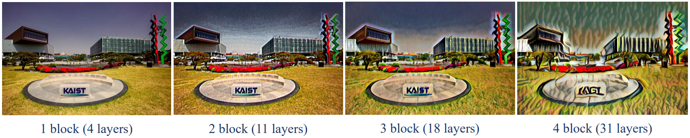
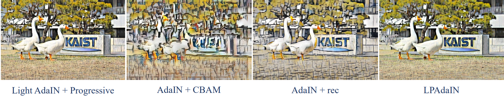

# LPAdaIN

This is an unofficial pytorch implementation of a paper, LPAdaIN: Light Progressive Attention Adaptive Instance Normalization Model for Style Transfer [Zhu Q+, Electronics 2022](https://www.mdpi.com/2079-9292/11/18/2929).
I'm really grateful to the [AdaIN code](https://github.com/naoto0804/pytorch-AdaIN), which is the base code of this repository.




## Requirements
Please install requirements by `pip install -r requirements.txt`
**To utilize GPU for training**, you need to install `torch` and `torchvision` manually, ensuring they match your GPU version.

- Python 3.12
- PyTorch 2.4+
- TorchVision
- Pillow

(optional, for training)
- tqdm
- TensorboardX
- torch with cuda
- torchvision with cuda

## Usage

### Download models
Download `model` from [google drive](https://drive.google.com/drive/folders/1chV_jOLh6qbUfOzhnfwQbh44GAkxFl4R?usp=sharing) and put them under main directory.

### Test
Use `--content` and `--style` to provide the respective path to the content and style image.
```
python test.py --content input/content/cornell.jpg --style input/style/woman_with_hat_matisse.jpg
```

You can also run the code on directories of content and style images using `--content_dir` and `--style_dir`. It will save every possible combination of content and styles to the output directory.
```
python test.py --content_dir input/content --style_dir input/style
```

You have to know the depth of trained decoder and put it using `--depth`. Default depth is 3. Original LPAdaIN is depth 3.
Depth can be 1, 2, 3, and 4.
```
python test.py --content <content> --style <style> --decoder <decoder_pth> --depth <depth_value>
```

This is an example of mixing four styles by specifying `--style` and `--style_interpolation_weights` option.
```
python test.py --content input/content/avril.jpg --style input/style/picasso_self_portrait.jpg,input/style/impronte_d_artista.jpg,input/style/trial.jpg,input/style/antimonocromatismo.jpg --style_interpolation_weights 1,1,1,1 --content_size 512 --style_size 512 --crop
```

Some other options:
* `--content_size`: New (minimum) size for the content image. Keeping the original size if set to 0.
* `--style_size`: New (minimum) size for the content image. Keeping the original size if set to 0.
* `--alpha`: Adjust the degree of stylization. It should be a value between 0.0 and 1.0 (default).
* `--preserve_color`: Preserve the color of the content image.
**These 4 options are much more important!**:
* `--model`: Can choose either `adain` or `lpadain`. Default is `lpadain`.
* `--cbam`: Can choose either trained data is trained with cbam or not. Use `--no-cbam` for model trained without cbam.
* `--mul_cbam`: Can choose either trained data is trained with multiple cbam or not. Use `--no-mul_cbam` for model trained without multiple cbam.
* `--reconstruction`: If you want to check just reconstruction, not style reflection, use this method.


### Train
Use `--content_dir` and `--style_dir` to provide the respective directory to the content and style images.
```
python train.py --content_dir <content_dir> --style_dir <style_dir>
```
You can change the depth of this model by adding `--depth`. You can put one of the number in (1, 2, 3, 4). Default depth is 3.
```
python train.py --content_dir <content_dir> --style_dir <style_dir> --depth <number in (1, 2, 3, 4)>
```

For more details and parameters, please refer to --help option.


## References
- [1]: X. Huang and S. Belongie. "Arbitrary Style Transfer in Real-time with Adaptive Instance Normalization.", in ICCV, 2017.
- [2]: [Original implementation for AdaIN]([https://github.com/xunhuang1995/AdaIN-style](https://github.com/naoto0804/pytorch-AdaIN))
- [3]:  Zhu, Q.; Bai, H.; Sun, J.; Cheng, C.; Li, X. LPAdaIN: Light Progressive Attention Adaptive Instance Normalization Model for Style Transfer. Electronics 2022, 11, 2929.
